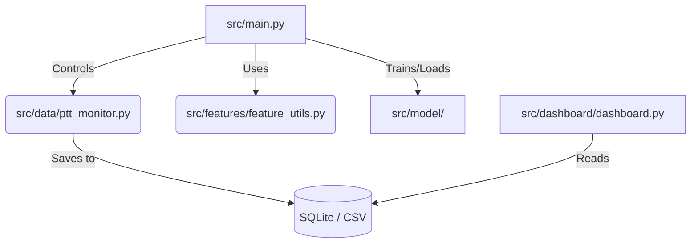

<div align="center">
    <span style="background-color: #2ea44f; color: #fff; padding: 8px 16px; border-radius: 20px 0 0 20px; font-weight: bold; font-family: sans-serif;">English</span><a href="README.zh-TW.md" style="background-color: #ffffff; color: #24292e; padding: 8px 16px; border-radius: 0 20px 20px 0; text-decoration: none; font-family: sans-serif; border: 1px solid #d0d7de; border-left: none;">繁體中文</a>
</div>

# PTT Trending Post Predictor & Adaptive System

<div align="center">
    
    
    
</div>

This project is a PTT (Bulletin Board System) data analysis and adaptive prediction system. Its core engine, `src/main.py`, continuously crawls data, predicts trending posts in real-time, and uses machine learning models to adaptively learn and optimize its predictions.

## Features

- **Real-time Crawling**: Continuously monitors PTT boards (e.g., Gossiping) for new posts and updates.
- **Adaptive Prediction**: Uses LightGBM to predict future popularity (push count) of posts.
- **Dynamic Learning**: The system retrains itself based on new data to adapt to changing trends.
- **Dashboard**: Visualizes data and predictions using Streamlit.

## Data Structure

The CSV snapshots (e.g., `data/YYYYMMDD/...csv`) contain the following key fields:

- `Post_ID`: Unique identifier for the post.
- `title`: Post title.
- `source_board`: Source board name.
- `real_push_score`: Net score (Push - Boo).
- `push_acceleration`: Rate of push accumulation.
- `key_phrases`: Extracted keywords from the content.
- `post_time`: Time the post was published.

## Installation & Setup

<details>
<summary>Click to expand detailed installation steps</summary>

This project uses `uv` for fast and reliable dependency management.

### 1. Install `uv`

If you haven't installed `uv` yet:

```bash
pip install uv
```

### 2. Initialize Environment

Create a virtual environment:

```bash
uv venv
```

### 3. Install Dependencies

Sync dependencies from `pyproject.toml`:

```bash
uv sync
```

</details>

## Usage

### Run the Main System

The main entry point is `src/main.py`. This script starts the full cycle of crawling, prediction, and adaptive learning ("Agentic" behavior).

```bash
uv run python src/main.py
```

### Run the Dashboard

To visualize the trending data:

```bash
uv run streamlit run src/dashboard/dashboard.py
```

## Project Structure



- `src/main.py`: Entry point.
- `src/data/`: Crawlers and Database management.
- `src/features/`: Feature engineering utilities.
- `src/model/`: Model training and evaluation logic.
- `src/dashboard/`: Streamlit dashboard app.
